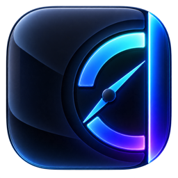

<div align="center">



# GaugeZ

**Your AI subscription limits, one glance away.**

A native macOS edge rail showing remaining quota for Claude, Codex, Cursor, Antigravity,
GLM, Grok Build, OpenCode, and GitHub Copilot.

[](#requirements)
[](#building)
[](#updates)
[](https://github.com/vzandli/GaugeZ/releases/latest)

<br>


</div>

---

## Overview

Every AI tool keeps its usage meter somewhere different. GaugeZ collects them into one
rail on the edge of your screen. Hover to expand it, read the rings, get back to work.

- **Edge rail, not a window.** A slim tab on any edge of any display. It expands on hover,
  never steals focus, and follows you across Spaces. On a MacBook it joins the hardware notch.
- **Remaining, never used.** Each ring shows what is left in the most constrained window.
  The detail card lists every window with its reset time.
- **Honest states.** Live, stale, signed out, permission needed, and unavailable are
  distinct. Missing data is never shown as `0%`.
- **Usage alerts.** Notifications at 20% and 0% remaining, mutable per provider.
- **Session activity.** Optional. See which Claude Code, Cursor, Grok Build, Codex, and
  Antigravity sessions are working, waiting, or idle. The rail can peek and chime when a
  session finishes or needs input.
- **Multiple Claude Code accounts.** Each `~/.claude-*` profile gets its own ring.
- **Make it yours.** Reorder providers, resize the notch, pick an edge and display, choose
  glass or solid, and decide whether GaugeZ shows in the Dock, the menu bar, or neither.
- **Automatic updates.** Signed with EdDSA and delivered through Sparkle.

## Providers

| Provider | Source of the reading |
| --- | --- |
| **Claude** | Claude desktop usage log, or the Claude Code sign-in in the Keychain |
| **Codex** | The bundled app-server or `codex` CLI; falls back to the CLI's ChatGPT sign-in |
| **Cursor** | Editor sign-in or the `cursor-agent` token; individual, team, and enterprise plans |
| **Antigravity** | Local language server, then the Google quota endpoint with the saved sign-in |
| **GLM** | Z.ai Coding Plan usage via a key held by Claude Code, ZCode, or OpenCode |
| **Grok Build** | The xAI sign-in in `~/.grok/auth.json`, via its billing service |
| **GitHub Copilot** | `GH_TOKEN`, the `gh` host token, or `gh auth token` |
| **OpenCode** | The Go plan usage endpoint with the key OpenCode stores on sign-in |

Providers are independent. A failure in one never affects another, and each can be
switched off in Settings. New providers start disabled on existing installations.

## Privacy

GaugeZ is a local companion. It talks only to the providers you enable, using the sign-ins
their apps already hold.

- Tokens are never written to disk or logged. Keychain items are cached in memory and
  re-read only when they change or you retry.
- Session activity reads local metadata. When Claude supplies no status, GaugeZ reads up to
  64 KB from the end of its local transcript to infer activity. Transcript text is never stored
  by GaugeZ or sent over the network.
- Near expiry, GaugeZ can launch standalone Claude Code with empty input to renew its sign-in;
  no prompt is supplied. Renewal is attempted once per expiry, with a ten-minute cooldown.
- No analytics, telemetry, or accounts. The only outbound call GaugeZ makes on its own is
  the update check against this repository's releases.

## Refresh policy

Reads coalesce per provider: about every minute while the rail is open or a session is
active, every five minutes otherwise, and again after wake or network recovery. Providers
that rate-limit are polled at most every five minutes. Retry backoff persists across
relaunches and honors server deadlines. The last good reading stays on screen during a
backoff and turns stale once its reset time passes.

## Requirements

- macOS 14 Sonoma or later. Liquid Glass surfaces need macOS 26.
- A supported provider signed in on this Mac.

## Install

1. Download `GaugeZ-x.y.z.zip` from the [latest release](https://github.com/vzandli/GaugeZ/releases/latest).
2. Move **GaugeZ.app** to Applications and launch it.

The app is signed with a Developer ID certificate and notarized by Apple.

## Updates

GaugeZ checks for updates in the background and on demand from the menu bar or
**Settings → Updates**. Every update is verified with an EdDSA signature before it is
installed. The feed is served from GitHub Releases.

## Building

```bash
git clone https://github.com/vzandli/GaugeZ.git
cd GaugeZ
open GaugeZ.xcodeproj
```

Requires Xcode 26.6 or later. Sparkle is the only dependency and resolves through Swift
Package Manager.

Run the fixture-based provider checks without touching real credentials:

```bash
./scripts/test-providers.sh
```

Preview the rail with demo data and no provider reads:

```bash
GAUGEZ_PREVIEW_DATA=1 GAUGEZ_DEBUG_DEMO=1 /path/to/GaugeZ.app/Contents/MacOS/GaugeZ
```

## Layout

```
GaugeZ/
├── App/           App delegate, menu bar, windows, Sparkle, release notes
├── Model/         Usage models, refresh scheduling, retry policy, alerts
├── Providers/     One adapter per provider
├── Credentials/   Keychain and config-file discovery, in-memory secret cache
├── Sessions/      Session activity readers, completion watcher, chimes
├── Rail/          Edge panel, rail geometry, meters, detail and settings cards
├── Windows/       Settings, usage overview, What's New
├── Design/        Brand font and styling
└── Resources/     Assets and third-party notices
Tests/             Provider regression checks
scripts/           Test runner and release publishing
```

## Contributing

Issues and pull requests are welcome. When adding a provider, keep the adapter
self-contained, decode defensively, and report an explicit health state instead of a
guessed number when the upstream format changes.

## Thanks

Claude transcript activity handling, the GitHub Copilot and GLM rings, and the Grok and Copilot logos are adapted from Codenotch
(MIT); see [Third-party notices](GaugeZ/Resources/ThirdPartyNotices.txt).
Edge rail design inspiration: [@hivinz_](https://x.com/hivinz_).
