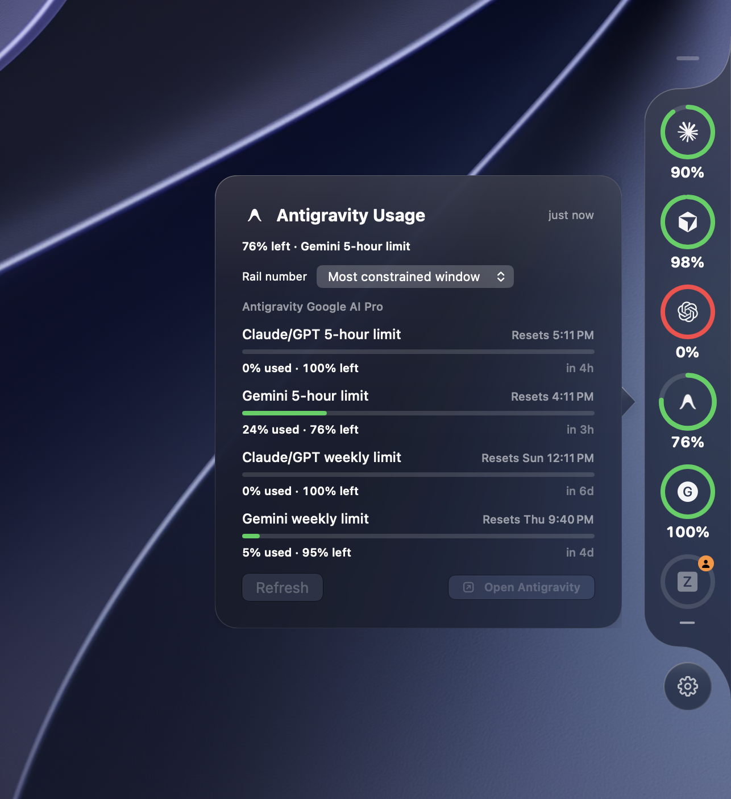

<div align="center">


# GaugeZ

**Your AI subscription limits, one glance away.**

A native macOS edge rail that shows how much of your Claude, Codex, Cursor, and Antigravity
quota is left, on any screen edge.

[](#requirements)
[](#building-from-source)
[](#updates)
[](https://github.com/vzandli/GaugeZ/releases/latest)

<br>



</div>

---

## Why

Every AI tool keeps its usage meter somewhere different: a settings pane, a web dashboard,
a CLI command. When you juggle several subscriptions, you end up guessing how close you
are to a limit until the moment you hit it.

GaugeZ puts all of those meters in one quiet rail at the edge of your screen. Hover to
expand it, glance at the rings, and get back to work.

## Features

- **Edge rail, not a window.** A slim tab lives on any edge of your chosen display
  and expands on hover. It never steals focus and follows you across Spaces.
- **Remaining, never used.** The compact number is always what you have *left*. When a
  provider has several windows, the rail shows the most constrained one by default. Pick a
  particular window or model in its detail card, which names the headline window and lists
  all windows with absolute and relative reset times.
- **Honest states.** Live, stale, signed out, permission needed, and unavailable are
  visually distinct. GaugeZ never turns missing data into `0%`.
- **Liquid Glass.** On macOS 26 the rail uses native glass with a 0 to 100 percent
  transparency slider. Older systems get a clean solid surface.
- **Menu bar companion.** Toggle the rail, refresh, open settings, or check for updates
  from the status item.
- **Session activity.** Opt in to Claude Code working, waiting, idle, and unknown states
  from its local session registry. Cards show session names, projects, and waiting reasons.
  Only records with a verifiable running process are shown; other providers do not yet
  expose activity through GaugeZ.
- **Make it yours.** Reorder providers, choose a persistent display, position the rail on
  any of its four edges, and enable launch at login. All edges share the same curved rail,
  settings orb, colored collapsed tab, and drag handle; horizontal text stays upright.
- **Keyboard access.** Choose **Usage…** in the menu bar for a regular, focusable usage
  window. Surfaces respect Reduce Transparency and Increase Contrast.
- **Diagnostics.** See each reading’s source, observation time, and next retry. Retry a
  provider, open its app, or forget its cached reading.
- **Automatic updates.** Signed and verified with Sparkle. See [Updates](#updates).

## Providers

| Provider | Where the numbers come from |
| --- | --- |
| **Claude** | The usage log kept by the Claude desktop app, or the Claude Code sign-in stored in your Keychain. |
| **Codex** | The app-server bundled with Codex (or ChatGPT), over a local process. |
| **Cursor** | Cursor's local sign-in, used to ask cursor.com for your plan usage. |
| **Antigravity** | The language server of a running Antigravity app or IDE, asked for its model quotas. |

Each provider can be switched off independently in Settings, and a failure in one never
affects the others.

## Privacy

GaugeZ is a local companion app.

- It talks only to the providers you enable, using the sign-in those apps already have.
- Tokens stay in memory for the duration of a request. They are never written to disk
  or logged.
- Optional activity monitoring reads Claude Code session metadata locally and does not
  persist it. It does not read conversation transcripts.
- No analytics, no telemetry, no accounts. The only outbound connection GaugeZ makes on
  its own is the update check against this repository's releases.

## Requirements

- macOS 14 Sonoma or later. Liquid Glass surfaces need macOS 26.
- The provider apps you want to track installed and signed in.

## Install

1. Download the latest `GaugeZ-x.y.zip` from the
   [Releases page](https://github.com/vzandli/GaugeZ/releases/latest).
2. Unzip and move **GaugeZ.app** to your Applications folder.
3. Launch it. GaugeZ appears in the menu bar and as a small tab on the screen edge.

The app is signed with a Developer ID certificate and notarized by Apple, so it opens
without Gatekeeper warnings.

## Updates

GaugeZ checks for updates automatically and can be checked manually from the menu bar or
**Settings → Updates**. Every update is signed with an EdDSA key and verified before it
is installed, and the feed is served straight from GitHub Releases.

## Building from source

```bash
git clone https://github.com/vzandli/GaugeZ.git
cd GaugeZ
open GaugeZ.xcodeproj
```

Select the **GaugeZ** scheme and run. Xcode resolves the single dependency,
[Sparkle](https://github.com/sparkle-project/Sparkle), through Swift Package Manager.
The project opens in Xcode 26.6 or later.

Or from the terminal:

```bash
xcodebuild -project GaugeZ.xcodeproj -scheme GaugeZ -configuration Release build
```

## Project layout

```
GaugeZ/
├── GaugeZApp.swift             App delegate, menu bar item, settings window
├── EdgePanelController.swift   Borderless edge panel, hover ownership, placement
├── EdgeViews.swift             Side rail, shared geometry, shapes, and hover attachments
├── HorizontalRailView.swift    Top and bottom placement
├── ProviderMeterView.swift     Quota ring and activity badge
├── UsageDetailCard.swift       Window selection, quota details, and session activity
├── AttachedSettingsView.swift  Compact rail settings
├── RailSurfaces.swift          Glass and accessible surface rendering
├── UsageOverviewView.swift     Keyboard-accessible usage window
├── ActivityReader.swift        Opt-in Claude Code session metadata
├── ProviderRetryPolicy.swift   Persistent per-provider rate-limit backoff
├── ContentView.swift           Settings: Providers, Appearance, Diagnostics, Updates
├── UsageStore.swift            Refresh scheduling, cache policy, normalized snapshots
├── UsageModels.swift           Provider IDs, windows, health states
├── *UsageProvider.swift        One adapter per provider
└── UpdateManager.swift         Sparkle integration
```

## Contributing

Issues and pull requests are welcome. If you are adding a provider, keep the adapter
self-contained, decode defensively, and surface an explicit health state instead of a
guessed number when the upstream format changes.

## Thanks

Design inspiration for the edge rail came from [@hivinz_](https://x.com/hivinz_). Thank you.

## Refresh behavior

GaugeZ coalesces refreshes per provider. Automatic reads run roughly every minute while
its rail is expanded or a monitored session is working/waiting, and every five minutes
otherwise. Claude is polled at most every five minutes because its usage endpoint
rate-limits faster polling; with the desktop app as source, its local usage log is read
first and the endpoint only when that log is stale. GaugeZ also refreshes after wake and
network recovery. Claude and Cursor retry penalties survive relaunches, increase after
repeated throttling, and honor server retry deadlines up to 15 minutes; the last good
reading stays on screen during a backoff. Forgetting a reading, disabling a provider, or
switching the Claude source clears its penalty. Passing a reset time marks an old reading
stale until the provider confirms its new value.

For a local visual preview without provider reads or update checks:

```sh
GAUGEZ_PREVIEW_DATA=1 GAUGEZ_DEBUG_DEMO=1 GAUGEZ_DEBUG_EDGE=top /path/to/GaugeZ.app/Contents/MacOS/GaugeZ
```
